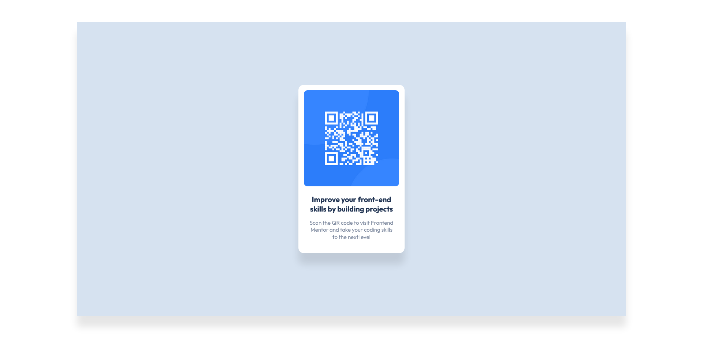

# Frontend Mentor - QR code component solution

This is a solution to the [QR code component challenge on Frontend Mentor](https://www.frontendmentor.io/challenges/qr-code-component-iux_sIO_H). Frontend Mentor challenges help you improve your coding skills by building realistic projects. 

## Table of contents

- [Overview](#overview)
  - [Screenshot](#screenshot)
  - [Links](#links)
- [My process](#my-process)
  - [Built with](#built-with)
  - [What I learned](#what-i-learned)
  - [Continued development](#continued-development)
  - [Useful resources](#useful-resources)
- [Author](#author)

## Overview

### Screenshot

### Links

- Live Site URL: (https://qr-code-component-challenge-solution.netlify.app/)

## My process

### Built with

- Semantic HTML5 markup
- CSS custom properties
- Flexbox
- CSS Grid
- Desktop-first workflow

### What I learned

I wouldn't say i learn that much with this challenge as i know everything it takes to solve the challenge. But of course the challenge gave me what i needed which is practising my newly acquired skills.

### Continued development

I would like to keep working on my css skills. Mainly flexbox and CSS grid.

### Useful resources

Jonas Schmedtmann html and css course on udemy.

## Author

- Frontend Mentor - [@Abu-Sman](https://www.frontendmentor.io/profile/@Abu-Sman)
- Twitter - [@Abu_Sman01](https://www.twitter.com/@Abu_Sman01)
